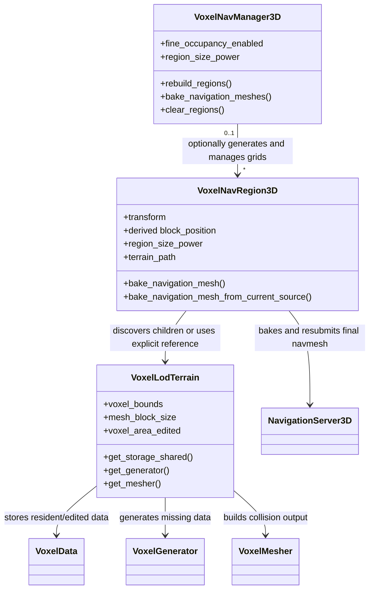
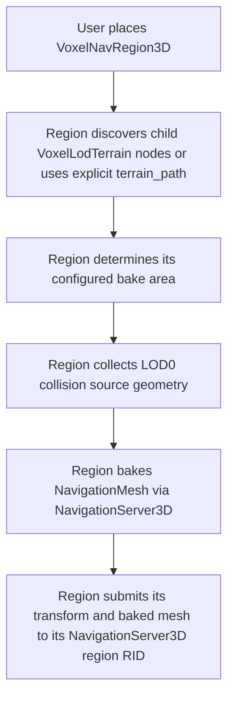
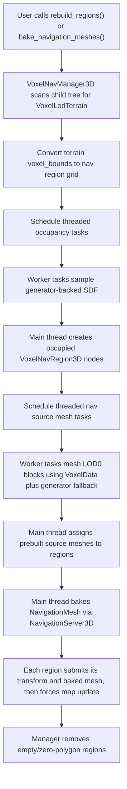

# Voxel Navigation Requirements

This document describes the current `VoxelNav` implementation requirements in concise, reproducible terms. It is intentionally behavioral and architectural, not code-level.

## Goals

- The system shall generate Godot `NavigationMesh` resources from voxel terrain collision geometry.
- The system shall generate adjacent navigation regions that connect through Godot's normal navigation edge-connection system without manual editor nudging.
- The system shall support smooth voxel terrains using Transvoxel/SDF meshing.
- The system shall treat navigation input as LOD0 collision geometry, not viewer-dependent render geometry.
- The system shall avoid creating navigation regions for terrain areas that cannot plausibly contain a surface.
- The system shall move expensive voxel source mesh generation off the main thread where possible.
- The system shall leave Godot `NavigationServer3D` baking on the main thread.
- The system shall explicitly synchronize baked mesh changes back to `NavigationServer3D` so runtime and editor pathfinding observe the same region connectivity.

## Scene API

- `VoxelNavRegion3D` shall be the primary user-facing region node for baking navigation from voxel terrain.
- `VoxelNavRegion3D` shall inherit `NavigationRegion3D`.
- `VoxelNavRegion3D` shall be usable manually without a `VoxelNavManager3D`.
- `VoxelNavRegion3D` shall discover child voxel landscapes in a manner analogous to how `NavigationRegion3D` discovers child mesh geometry.
- `VoxelNavRegion3D` shall be able to bake navigation from child `VoxelLodTerrain` nodes within its configured region.
- `VoxelNavRegion3D` shall support an explicit terrain reference/path when a manager or user assigns one.
- `VoxelNavRegion3D` shall store:
  - a `terrain_path` pointing to its source `VoxelLodTerrain`;
  - a `region_size_power`;
  - a `VoxelNavMeshSettings` resource reference.
- `VoxelNavRegion3D` shall derive its terrain block position from its transform relative to the selected/discovered `VoxelLodTerrain`.
- `VoxelNavRegion3D` shall not require users to author `block_position` directly.
- `block_position` shall be treated as a derived/internal LOD0 mesh-block grid key.
- `block_position` may be exposed for debugging, but it shall not be the primary authored source of truth.
- `VoxelNavManager3D` shall be an optional orchestration node for large or dynamic terrains.
- `VoxelNavManager3D` shall discover, create, clear, and bake grids of `VoxelNavRegion3D` nodes.
- `VoxelNavManager3D` shall search its child tree for `VoxelLodTerrain` nodes when building managed region grids.
- `VoxelNavManager3D` shall own only the `VoxelNavRegion3D` nodes it generated.
- `VoxelNavManager3D` shall mark generated regions so they can be recognized and cleared after editor reloads or stale manager state.
- `VoxelNavManager3D` shall assign generated regions their terrain references, region coordinates, navigation layers, and nav mesh settings.
- `VoxelNavManager3D` shall support rebuilding managed regions cheaply after terrain edits.
- `VoxelNavManager3D` shall automatically observe terrain edits from the `VoxelLodTerrain` nodes it governs.
- `VoxelNavManager3D` shall expose `nav_mesh_settings`.
- `VoxelNavManager3D` shall expose `bake_on_ready`.
- `VoxelNavManager3D` shall expose `navigation_layers`.
- `VoxelNavManager3D` shall expose `region_size_power`.
- `VoxelNavManager3D` shall expose `fine_occupancy_enabled`.
- `fine_occupancy_enabled == false` shall select coarse occupancy.
- `fine_occupancy_enabled == true` shall select fine occupancy.
- `VoxelNavManager3D::clear_regions()` shall remove generated child regions and clear their navigation meshes from the navigation server.
- `VoxelNavManager3D::clear_regions()` shall also clear generated direct child regions that are not present in the manager's current retained region list.

## Editor UI

- `VoxelNavRegion3D` shall use the native `NavigationRegion3D` editor bake and clear toolbar actions.
- The voxel editor plugin shall not add a separate `VoxelNavRegion3D` bake or clear menu when a region is selected.
- `VoxelNavManager3D` shall expose direct toolbar buttons for baking and clearing generated navigation regions.
- `VoxelNavManager3D` toolbar actions shall use the same flat button style as the native `NavigationRegion3D` editor actions.
- `VoxelNavManager3D` toolbar actions shall use native editor icons rather than a dropdown menu.
- `Bake Navigation Regions` shall rebuild generated regions and then bake them.
- `Clear Navigation Regions` shall clear generated navigation meshes and remove generated region nodes.

## Region Layout

- A nav region shall cover `2^region_size_power` LOD0 mesh blocks on each axis.
- A nav region's voxel size shall be:

```text
terrain.mesh_block_size * (1 << region_size_power)
```

- A manual nav region's transform shall be the authored source of truth for its terrain-space origin.
- A nav region shall derive its terrain-local origin from:

```text
terrain_local_origin = terrain.global_transform.affine_inverse() * nav_region.global_transform.origin
```

- A nav region shall derive `block_position` from:

```text
block_position = floor(terrain_local_origin / terrain.mesh_block_size)
```

- A manager-generated nav region shall have its transform placed on this same derived grid.
- A manager-generated nav region's derived `block_position` shall be aligned to the nav region size in mesh-block coordinates.
- A manually placed nav region shall floor to the containing LOD0 mesh block.
- A nav region's final baked navigation mesh shall end exactly at the configured local X/Z region bounds.
- A nav region's source geometry shall include enough neighboring terrain to let Godot bake walkable surface up to the configured region edge.
- A nav region's source geometry border shall be at least one LOD0 mesh block on every side of the configured region.
- A nav region's bake filter AABB shall be expanded on X/Z by the computed bake border size.
- A nav region's `NavigationMesh.border_size` shall match the X/Z bake filter expansion so Godot cuts the final baked surface back to the configured region bounds.
- The computed bake border size shall be:

```text
ceil(agent_radius / cell_size) * cell_size
```

- If `cell_size <= 0`, the computed bake border size shall be `0`.
- `NavigationMesh.edge_max_error` shall not be allowed above `1.0` for voxel nav bakes, so tile-aligned border edges remain precise enough to connect.
- A nav region's generated source mesh vertices shall be local to the nav region origin.
- Terrain-relative grid derivation shall occur in terrain local space.
- Voxel navigation shall assume terrain transforms are usable for stable terrain-local grid derivation.

## Region Connectivity

- `VoxelNavRegion3D` shall enable Godot navigation edge connections.
- Adjacent generated regions shall be positioned so their configured bounds touch exactly in terrain-local space.
- Adjacent generated regions shall produce matching final navmesh edges at their shared boundary.
- Adjacent regions shall connect without moving, rotating, toggling, or otherwise editing the nodes after baking.
- Moving a region in the editor may force Godot to rebuild links, but that shall not be required for baked voxel navigation to be usable.
- After `NavigationServer3D::bake_from_source_geometry_data()` mutates a region's `NavigationMesh`, `VoxelNavRegion3D` shall submit its current global transform to the region RID with `NavigationServer3D::region_set_transform()`.
- After submitting its current transform, `VoxelNavRegion3D` shall resubmit the mesh to the region RID with `NavigationServer3D::region_set_navigation_mesh()`.
- After resubmitting a baked or cleared mesh, `VoxelNavRegion3D` shall force the navigation map to complete an update when the region has a valid navigation map.
- The forced bake/clear update may temporarily disable region and map async iterations, but it shall restore the previous async settings immediately afterward.
- Voxel navigation shall rely on Godot's derived map edge connections and shall not create persistent `NavigationLink3D` nodes or manual connection objects between adjacent regions.

## Occupancy Discovery

- `VoxelNavManager3D::rebuild_regions()` shall clear old generated regions before discovering new regions.
- Region discovery shall iterate over `VoxelLodTerrain::voxel_bounds`.
- Region discovery shall convert terrain voxel bounds to nav region coordinates.
- Region discovery shall reject terrains whose bounds would create more than the implementation cap.
- Region discovery shall not depend on the player, viewer, editor camera, resident LOD selection, or currently visible terrain mesh.
- Region discovery shall query generator-backed SDF samples.
- Region discovery shall create a `VoxelNavRegion3D` only if occupancy indicates a possible surface.
- Empty occupancy results shall not create `VoxelNavRegion3D` nodes.
- Occupancy shall detect a possible surface if sampled SDF values cross sign or fall within the configured near-surface threshold.
- Coarse occupancy shall probe tiled groups of nav regions.
- Fine occupancy shall probe at smaller granularity and shall be more conservative.
- Occupancy work shall be scheduled through `VoxelEngine` threaded tasks.
- Occupancy task results shall create scene nodes only from `apply_result()` on the main thread.
- Stale occupancy task results shall be ignored using a rebuild generation id.

## Terrain Change Invalidation

- `VoxelLodTerrain` shall emit a main-thread signal when LOD0 terrain content changes.
- The terrain-change signal shall report the edited LOD0 voxel area as a position and size.
- `VoxelLodTerrain::post_edit_area()` shall emit the terrain-change signal after it records edited LOD0 blocks and voxel areas.
- `VoxelLodTerrain::post_edit_modifiers()` shall emit the terrain-change signal for generator/modifier invalidated areas.
- `VoxelNavManager3D` shall connect only to `VoxelLodTerrain` nodes discovered under its child tree, excluding terrains under managed `VoxelNavRegion3D` children.
- On a terrain-change signal, `VoxelNavManager3D` shall compute the nav regions whose source geometry may include the edited voxels.
- The affected-region calculation shall expand the edited LOD0 voxel area by the nav source border before converting to nav region coordinates.
- Incremental terrain-change handling shall not clear or rebuild every generated region.
- Incremental terrain-change handling shall schedule source mesh generation only for affected region coordinates.
- If an affected region already exists, the manager shall regenerate source geometry and rebake only that region.
- If an affected region does not exist but source generation finds collision geometry, the manager shall create a new generated `VoxelNavRegion3D` for that region and bake it.
- If source generation finds no collision geometry for an affected existing region, the manager shall clear and remove that generated region.
- Incremental terrain-change handling shall use the same LOD0 `VoxelData` plus generator fallback source path as normal manager baking.
- Stale incremental source task results shall be ignored using the source-generation id.

## Source Geometry

- Navigation source geometry shall be collision geometry.
- `VoxelNavRegion3D` shall be responsible for collecting voxel source geometry for its own bake area.
- Manual `VoxelNavRegion3D` usage shall collect source geometry from child voxel terrain nodes or an explicitly assigned terrain.
- Manager-generated `VoxelNavRegion3D` nodes shall receive their source terrain and region coordinates from `VoxelNavManager3D`.
- Navigation source geometry shall use LOD0 data.
- Navigation source geometry shall not use viewer-selected terrain LOD.
- Navigation source geometry shall not read already-visible render meshes as its authority.
- Navigation source geometry shall use the same mesher collision output semantics as physics collision.
- Physics collision extraction and nav source extraction shall share collision-triangle extraction logic.
- Transvoxel transition geometry shall not be required for nav source generation.
- Nav source generation shall prefer the normal terrain meshing data path.
- Nav source generation shall use `VoxelData` blocks when they exist.
- Nav source generation shall fall back to the terrain generator for missing voxel boxes.
- Nav source generation shall operate per LOD0 mesh block, not by generating one monolithic dense buffer for the whole nav region.
- Nav source generation shall include neighboring LOD0 mesh blocks around a region when needed for exact edge baking.
- Nav source generation shall append per-block collision triangles into one source mesh per `VoxelNavRegion3D`.
- Appended per-block vertices shall be offset into nav-region-local coordinates.
- Nav source generation shall run in worker tasks before Godot navigation baking begins.
- Nav source task results shall assign source meshes to `VoxelNavRegion3D` only from `apply_result()` on the main thread.
- Stale nav source task results shall be ignored using a source-generation id.

## Baking

- `VoxelNavRegion3D::bake_navigation_mesh()` shall support standalone/manual baking.
- `VoxelNavManager3D::bake_navigation_meshes()` shall delay if occupancy discovery is still running.
- `VoxelNavManager3D::bake_navigation_meshes()` shall schedule threaded nav source generation before baking.
- Godot navigation baking shall run only after source mesh generation has completed.
- `VoxelNavRegion3D` shall bake from its current prebuilt source mesh when driven by `VoxelNavManager3D`.
- `VoxelNavRegion3D::bake_navigation_mesh()` may keep a direct fallback path for standalone/manual region baking.
- Regions with no source mesh shall be skipped.
- Regions producing zero navigation polygons shall be removed from the manager's retained region list.
- Generated `NavigationMesh` resources shall use settings from `VoxelNavMeshSettings` when available.
- Generated regions shall apply the manager's `navigation_layers`.
- Baking shall configure navmesh bounds before calling Godot's bake API.
- Baking shall submit the current region transform and baked `NavigationMesh` to the region RID after Godot's bake API returns.
- Baking shall force the navigation map to complete an update after the baked mesh is resubmitted.
- Clearing a region's navigation mesh shall also submit the current transform and cleared mesh to the region RID, then force a completed navigation map update.

## Threading

- Worker tasks shall not add, remove, or modify scene nodes.
- Worker tasks shall not call Godot navigation baking APIs.
- Worker tasks may query thread-safe voxel generators.
- Worker tasks may build voxel mesher output.
- Main-thread `apply_result()` shall be responsible for:
  - creating `VoxelNavRegion3D` nodes;
  - assigning generated source meshes;
  - starting the final navigation bake phase.
- Manager rebuilds, clears, and new bake requests shall invalidate stale worker results.
- The system shall log broad timing summaries for occupancy, source mesh generation, and navigation baking.

## Logging

- Occupancy scheduling shall log task count and coarse/fine mode.
- Occupancy completion shall log checked, occupied, skipped, worker time, apply time, and max task time.
- Nav source generation scheduling shall log task count and region block size.
- Nav source completion shall log empty regions, meshed blocks, empty blocks, worker time, apply time, and max task time.
- Slow bake regions shall log source mesh time, source geometry time, nav server time, and total time.
- Terrain fallback source generation shall log generator, modifier, mesher, extraction, AABB, and total time.

## Class Relationships



## Pipeline

### Manual Region Pipeline



### Manager Grid Pipeline



## Non-Goals

- The system shall not require `VoxelNavManager3D` for simple or manually authored navigation regions.
- The system shall not use player/viewer position to decide nav source LOD.
- The system shall not use resident render mesh LOD as authoritative nav input.
- The system shall not silently skip large regions because they are expensive.
- The system shall not create region nodes for known-empty occupancy results.
- The system shall not require a hidden `MeshInstance3D` child to hold nav source geometry.
- The system shall not require editor transform edits to make adjacent baked regions link.
- The manager editor UI shall not use a dropdown for bake and clear actions.

## Known Constraints

- Godot navigation baking remains a main-thread cost.
- Source mesh `ArrayMesh` creation remains a main-thread cost.
- Direct `VoxelNavRegion3D::bake_navigation_mesh()` may still use the fallback terrain region source path.
- The manager-driven path is the intended optimized path for large grids and terrain-edit rebuilds.
- The standalone `VoxelNavRegion3D` path is the intended ergonomic path for manually placed/local navigation areas.
- Custom nav bake bounds beyond the generated region grid are not yet specified here.
